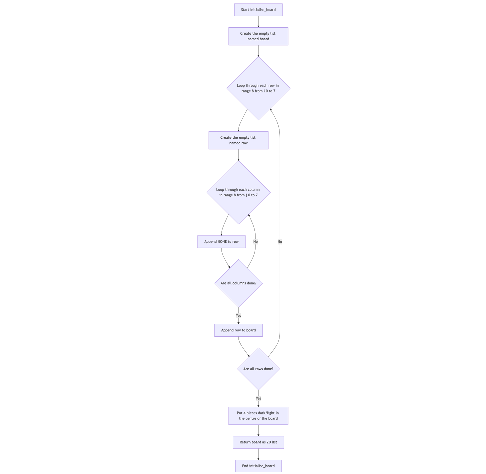
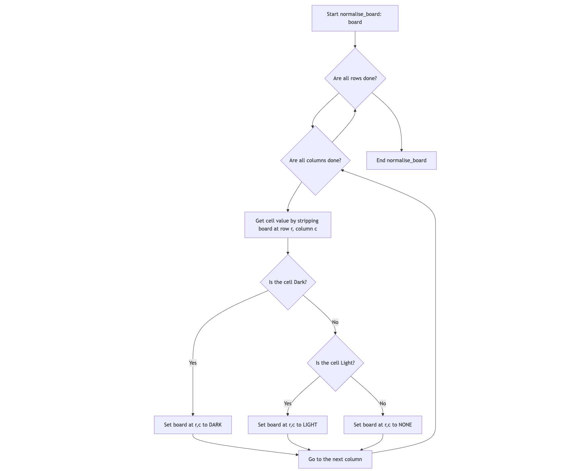
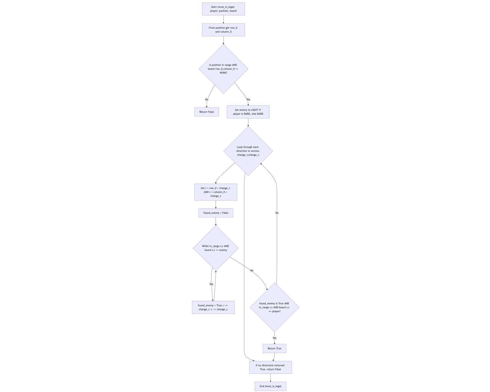
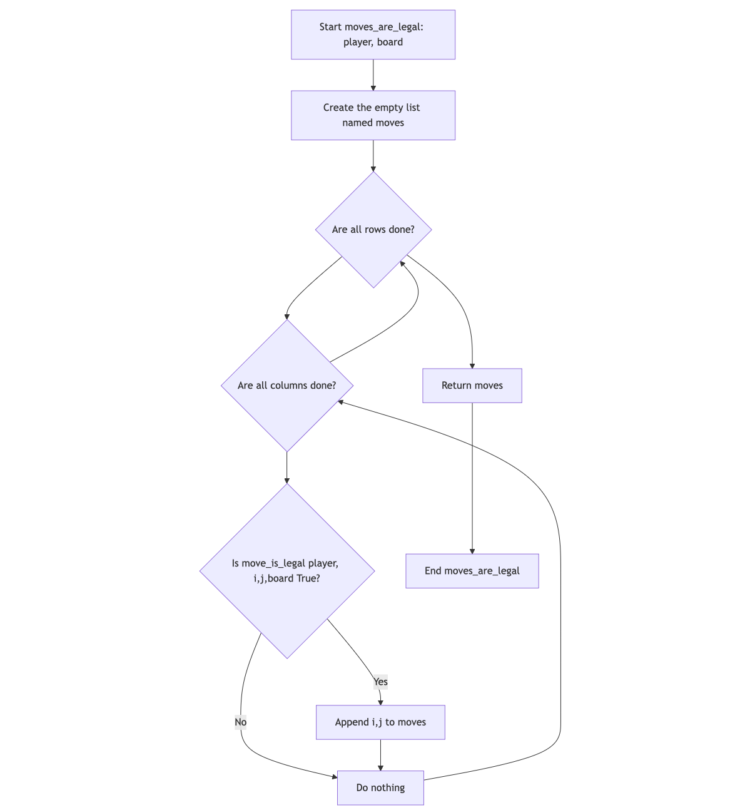
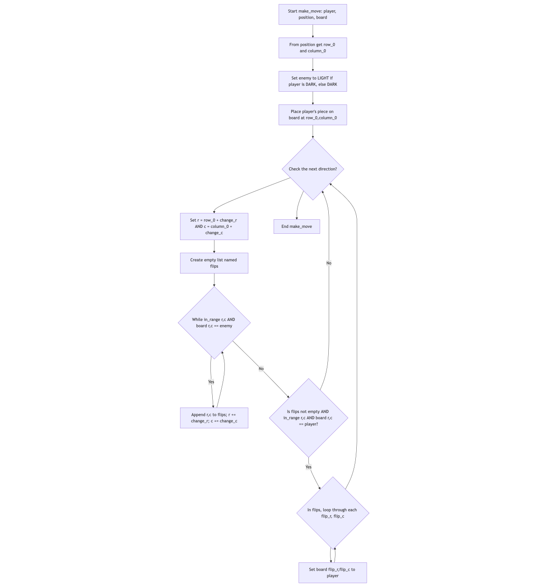
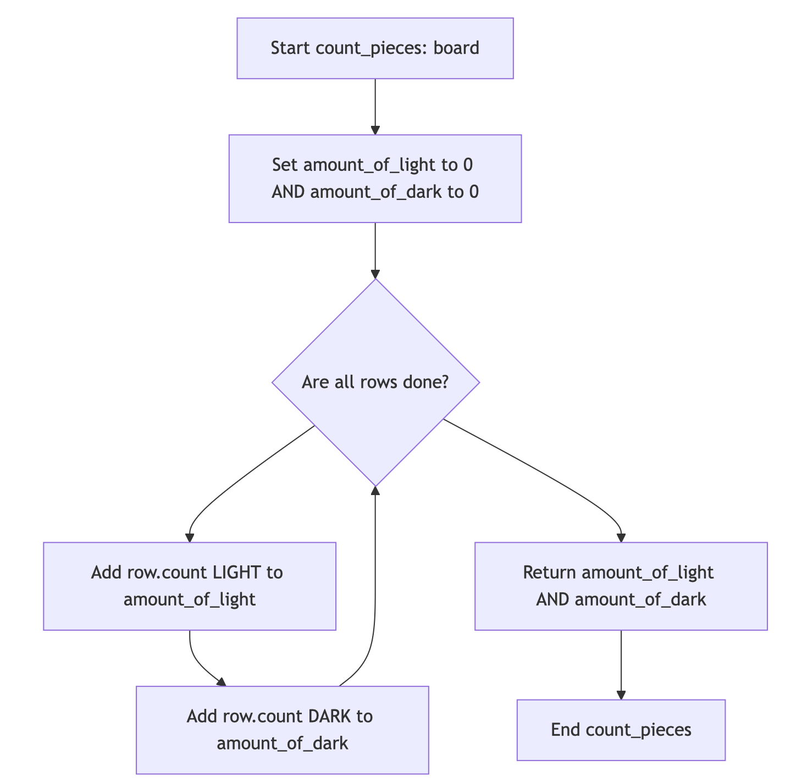
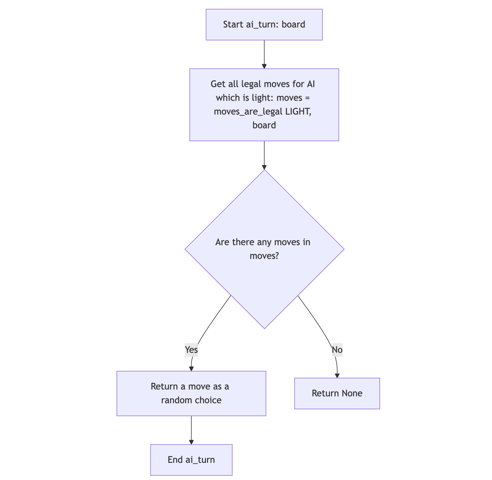
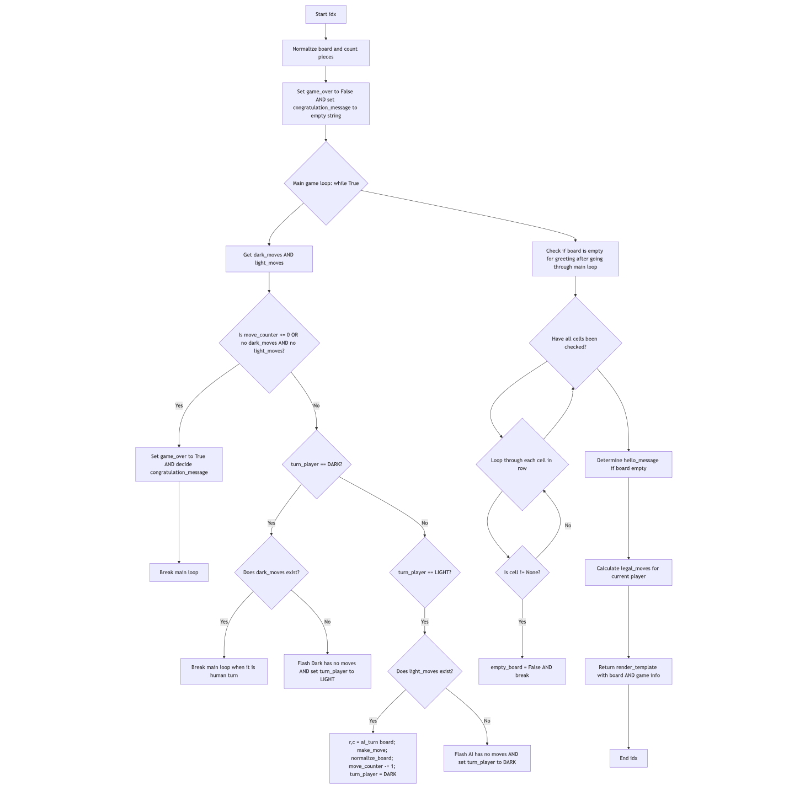

1. a)

[//]: # (First loop)
def initialise_board():
    """ The initialisation of the board 8x8 and putting on it in initial places our pieces."""
    board = []
    for i in range(8):
        row = []
        for i in range(8):
            row.append(NONE)
        board.append(row)

flowchart TD
    A[Start initialise_board()] --> B[Create the empty list named board]
    B --> C{Loop through each row in range 8 (i = 0 to 7)}
    C --> D[Create the empty list named row]
    D --> E{Loop through each column in range 8 (j = 0 to 7)}
    E --> F[Append NONE to row]
    F --> G{Are all columns done?}
    G -- No --> E
    G -- Yes --> H[Append row to board]
    H --> I{Are all rows done?}
    I -- No --> C
    I -- Yes --> J[Put 4 pieces dark/light in the centre of the board]
    J --> K[Return board as 2D list]
    K --> L[End initialise_board]

[//]: # (Second Loop)
def normalise_board(board):
    """Verify board squares have consistent constants."""
    for r in range(8):
        for c in range(8):
            cell = board[r][c].strip()
            if cell == "Dark":
                board[r][c] = DARK
            elif cell == "Light":
                board[r][c] = LIGHT
            else:
                board[r][c] = NONE
flowchart TD
    A[Start normalise_board(board)] --> B{Loop through each row in range 8 (r = 0 to 7)}
    B --> C{Loop through each column in range 8 (c = 0 to 7)}
    C --> D[Get cell value by stripping the board: cell = board[r][c].strip()]
    D --> E{Is the cell "Dark "?}
    E -- Yes --> F[Set board[r][c] to the dark: board[r][c] = DARK]
    E -- No --> G{Is cell "Light"?}
    G -- Yes --> H[Set board[r][c] to the light: board[r][c] = LIGHT]
    G -- No --> I[Set board[r][c] to the none: board[r][c] = NONE]
    F --> J[Go to the next column]
    H --> J
    I --> J
    J --> C{Are all columns done?}
    C --> B{Are all rows done?}
    B --> K[End normalise_board]

[//]: # (Third loop)
def move_is_legal(player, position, board):
    row_0, column_0 = position
    if not in_range(row_0, column_0) or board[row_0][column_0] != NONE:
        return False
    enemy = LIGHT if player == DARK else DARK
    for change_r, change_c in vectors:
        r, c = row_0 + change_r, column_0 + change_c
        found_enemy = False
        while in_range(r, c) and board[r][c] == enemy:
            found_enemy = True
            r += change_r
            c += change_c
        if found_enemy and in_range(r, c) and board[r][c] == player:
            return True
    return False

flowchart TD
A[Start move_is_legal(player, position, board)] --> B[From position get row_0 and column_0 ]
B --> C{Is position in range and board[row_0][column_0] == NONE?}
C -- No --> D[Return False]
C -- Yes --> E[Set enemy to LIGHT if player is DARK, else DARK]
E --> F{Loop through each direction in vectors (change_r, change_c)}
F --> G[Set r to row_0 + change_r and c to column_0 + change_c]
G --> H[found_enemy = False]
H --> I{While in_range(r, c) and board[r][c] == enemy}
I -- Yes --> J[found_enemy = True; r += change_r; c += change_c]
J --> I
I -- No --> K{found_enemy is True and in_range(r, c) and board[r][c] == player?}
K -- Yes --> L[Return True]
K -- No --> F{Check the next direction?}
F --> M[If no directions returned True, return False]
L --> M
M --> N[End move_is_legal]

[//]: # (Fourth loop)
def moves_are_legal(player, board):
    moves = []
    for r in range(8):
        for c in range(8):
            if move_is_legal(player, (r, c), board):
                moves.append((r, c))
    return moves

flowchart TD
    A[Start moves_are_legal(player, board)] --> B[Create the empty list named moves]
    B --> C{Loop through each row in range 8 (i = 0 to 7)}
    C --> D{Loop through each column in range 8 (j = 0 to 7)}
    D --> E{Is move_is_legal(player, (i, j), board) True?}
    E -- Yes --> F[Append (i, j) to moves]
    E -- No --> G[Do nothing]
    F --> G
    G --> D{Are all columns done?}
    D --> C{Are all rows done?}
    C --> H[Return moves]
    H --> I[End moves_are_legal]

[//]: # (Fifth loop)
def make_move(player, position, board):
    row_0, column_0 = position
    enemy = LIGHT if player == DARK else DARK
    board[row_0][column_0] = player
    for change_r, change_c in vectors:
        r, c = row_0 + change_r, column_0 + change_c
        flips = []
        while in_range(r, c) and board[r][c] == enemy:
            flips.append((r, c))
            r += change_r
            c += change_c
        if flips and in_range(r, c) and board[r][c] == player:
            for flip_r, flip_c in flips:
                board[flip_r][flip_c] = player

flowchart TD
    A[Start make_move(player, position, board)] --> B[From position get row_0 and column_0]
    B --> C[Set enemy to LIGHT if player is DARK, else DARK]
    C --> D[Place player's piece on board at (row_0, column_0)]
    D --> E{Loop through each direction in vectors (change_r, change_c)}
    E --> F[Set r to row_0 + change_r and c to column_0 + change_c]
    F --> G[Create empty list named flips]
    G --> H{While in_range(r, c) and board[r][c] == enemy}
    H -- Yes --> I[Append (r, c) to flips; r += change_r; c += change_c]
    I --> H
    H -- No --> J{Is flips not empty and in_range(r, c) and board[r][c] == player?}
    J -- Yes --> K{In flips, loop through each flip_r, flip_c}
    K --> L[Set board[flip_r][flip_c] to player]
    L --> K
    J -- No --> E{Check the next direction?}
    K --> E
    E --> M[End make_move]

[//]: # (Sixth loop)
def count_pieces(board):
 amount_of_light = 0
 amount_of_dark = 0
 for row in board:
     amount_of_light += row.count(LIGHT)
     amount_of_dark += row.count(DARK)
 return amount_of_light, amount_of_dark

flowchart TD
    A[Start count_pieces(board)] --> B[Set amount_of_light to 0 and amount_of_dark to 0]
    B --> C{In board loop through every single row}
    C --> D[Add row.count(LIGHT) to amount_of_light]
    D --> E[Add row.count(DARK) to amount_of_dark]
    E --> C{Are all rows done?}
    C --> F[Return amount_of_light and amount_of_dark]
    F --> G[End count_pieces]

[//]: # (Seventh loop)
def ai_turn(board):
 moves = moves_are_legal(LIGHT, board)
 if moves:
     return random.choice(moves)
 return None

flowchart TD
    A[Start ai_turn(board)] --> B[Get all legal moves for AI which is light: moves = moves_are_legal(LIGHT, board)]
    B --> C{Are there any moves in moves?}
    C -- Yes --> D[Return a move as a random choice]
    C -- No --> E[Return None]
    D --> F[End ai_turn]

[//]: # (Eighth loop)
@app.route("/")
def idx():
    global board, turn_player, move_counter
    normalize_board(board)
    amount_of_light, amount_of_dark = count_pieces(board)
    game_over = False
    congratulation_message = ""
    while True:
        dark_moves = moves_are_legal(DARK, board)
        light_moves = moves_are_legal(LIGHT, board)
        if move_counter <= 0 or (not dark_moves and not light_moves):
            game_over = True
            if amount_of_light > amount_of_dark:
                congratulation_message = "Congratulations, light wins"
            elif amount_of_dark > amount_of_light:
                congratulation_message = "Congratulations, dark wins"
            else:
                congratulation_message = "Tie!"
            break
        if turn_player == DARK:
            if dark_moves:
                break
            flash("Dark hasn't got legal moves, AI turn")
            turn_player = LIGHT
        elif turn_player == LIGHT:
            if light_moves:
                r, c = ai_turn(board)
                make_move(LIGHT, (r, c), board)
                normalize_board(board)
                move_counter -= 1
                flash(f"AI move to ({r+1}, {c+1})")
                turn_player = DARK
            else:
                flash("AI has no legal moves, human turn")
                turn_player = DARK
    hello_message = ""
    if move_counter == 60:
        empty_board = True
        for row in board:
            for cell in row:
                if cell != 'None ':
                    empty_board = False
                    break
        if empty_board:
            hello_message = "Hello player! Welcome to game Othello!"
    legal_moves = moves_are_legal(DARK, board) if turn_player == DARK else []
    return render_template(
        "index.html",
        board=board,
        turn_player=turn_player,
        move_counter=move_counter,
        game_over=game_over,
        congratulation_message=congratulation_message,
        hello_message=hello_message,
        amount_of_light=amount_of_light,
        amount_of_dark=amount_of_dark,
        legal_moves=legal_moves
    )

flowchart TD
    A[Start idx()] --> B[Normalize board and count pieces]
    B --> C[Set game_over to False and set congratulation_message to ""]
    C --> D{Main game loop: while True}
    D --> E[Get dark_moves and light_moves]
    E --> F{Is move_counter <= 0 or (no dark_moves and no light_moves)?}
    F -- Yes --> G[Set game_over to True and decide congratulation_message]
    G --> H[Break main loop]
    F -- No --> I{turn_player == DARK?}
    I -- Yes --> J{Does dark_moves exist?}
    J -- Yes --> K[Break main loop when it is human turn]
    J -- No --> L[Flash "Dark has no moves" and set turn_player to LIGHT]
    I -- No --> M{turn_player == LIGHT?}
    M -- Yes --> N{Does light_moves exist?}
    N -- Yes --> O[r, c = ai_turn(board); make_move; normalize_board; move_counter -= 1; turn_player = DARK]
    N -- No --> P[Flash "AI has no moves" and set turn_player to DARK]
    D --> Q[Check if board is empty for greeting, after going through main loop]
    Q --> R{In board loop through each row}
    R --> S{In row loop through each cell}
    S --> T{Is cell != 'None '?}
    T -- Yes --> U[empty_board = False then break]
    T -- No --> S
    S --> R{Have we check all cells?}
    R --> V[Determine hello_message if board empty]
    V --> W[Calculate legal_moves for current player]
    W --> X[Return render_template with board and game info]
    X --> Y[End idx()]

b)  
    In the code I used constants DARK, LIGHT, and NONE to represent pieces and empty squares on the board.
    So first in our code I created the function initialise_board() to initialise the board size 8x8 and to set the initial four pieces (DARK/LIGHT) in the center of this playing board, which sets up the initial point for Othello game.
    This module:
                Creates the 8 by 8 list of lists, which are filled with NONE (indicating empty cells);
                Places the pieces(DARK/LIGHT) in the center of the board;
                Returns this board as a 2D list.
    Then I created function normalise_board(board) to make sure that every single cell on the board has a constant: DARK, LIGHT, or NONE.
    This module:
                Loops through each board's cell;
                If the string has extra spaces, or being inconsistent with formatting,in our case, converts it into the right constant (DARK="Dark ", LIGHT="Light", NONE='None');
                Makes sure that logic of my game can correctly detect when cells are empty and types  of pieces.
    Next step was to check if a given board coordinate is valid, so I created in_range(r,c).
    This module:
                Returns True if r and c are between 0 and 7 (inclusive), meaning they are within the 8×8 board; although it does not check legality of moves, only coordinates.
    After that it is important to check if a move by a player at a given position is legal according to Othello rules, that's why I created function move_is_legal(player, position, board).
    This module:
                Makes sure if the chosen cell is within board limits and empty (NONE);
                From the selected cell checks all eight directions in order to see if at least one enemy piece can be flipped;
                Returns True if the move is legal (flips at least one enemy piece). In other case it returns False.
    To find all legal moves for the given player, I needed to create function moves_are_legal(player, board).
    This module: 
                Loops through each board cells;
                Calls move_is_legal for each cell;
                For all legal moves appends the coordinates to a list;
                Returns the list of legal moves.
    In order to execute a move at a particular position for a player, I created function make_move(player, position, board).
    This module:
                Places the player’s piece on the board;
                Tries to find enemy pieces to flip, by checking all eight directions; 
                Flips the pieces to the player’s constant by updating their values.
    Next function I created was count_pieces(board) to count how many pieces on the board each player has.
    This module:
                Loops through all board rows;
                Counts occurrences of DARK and LIGHT;
                Returns two values such as amount_of_light and amount_of_dark.
    After that I got to task about AI opponent, function ai_turn(board) determines the AI's move for the LIGHT player, the opponent.
    This module:  
                By calling moves_are_legal, gets all legal moves for LIGHT;
                Selects randomly a move from the legal options;
                Returns the selected move, or None if there are no legal moves.
    In this step, I created the main loop function idx() for our game in the Flask route /, which handles rendering the board and game state.
    This module: 
                Normalises the board and counts the pieces;
                Checks for each player legal moves;
                Handles player turns, where human DARK and AI opponent LIGHT; alternates turns between players and handles cases where a player has no legal moves, and updates messages for the front-end display;
                Updates the game state like moves, turn, messages, and conditions when game is over;
                Returns the board and all relevant information to the HTML template for display.
    In the Flask route /game which has methods GET(which is automatically assigned) and POST, I created function game(), which handles a human player’s move submission.
    This module: 
                Validates if the move is legal;
                Updates the board and the move counter;
                Switches the turn to our AI opponent if the move is valid;
                Provides feedback messages for illegal moves or no available moves.
    The function save_game() in Flask route /save_game saves the current game state to a JSON file, which is called finished_product.
    This module:
                Stores the board, current player, and remaining moves in a file;
                Provides feedback by confirming the save to the person playing the game.
    The last function I used in this final code for this game is called load_game(), which is in Flask route /load_game. 
    This function loads from our JSON file our saved code.
    This module:
                From the file reads the board, current player, and move counter;
                Normalises after loading the board to ensure consistent constants;
                If no saved game is found, provides feedback.
                

c)
        Firstly, I created constants DARK, LIGHT, NONE in config.py to make my further code more readable, as this makes it always clear what each value represents.
    Also it reduces errors in my code, if I make an inconsistent formating or typo.
        I created initialise_board() function to separate the  setup of the 8×8 board from the rest of the code. 
    Returning 2D list let all other modules to work with the board structure much easier, and putting all four pieces in this function makes sure that the game starts as the Othello game.
        Next was the function normalise_board(board), which helps me to prevent logical errors when checking for DARK, LIGHT, or NONE, by normalising all cell values. 
    In addition, it helps me to avoid unnecessary bugs caused by mismatched strings and makes the game's behaviour predictable.
        The function in_range(r, c) I chose to make, as it simplifies the code, because it is a function that checks separately coordinates.
    Also it avoids repeating the same coordinate checks in multiple modules, by making sure that all directions it is checking on the board are within parameters 8x8.
        Othello game rules require that a move must flip at least one enemy piece, so in order to do so I created function move_is_legal(player, position, board), to perform all eight directional checks together for consistent rule enforcement.
    By keeping this logic separate lets other parts of the program, like the AI opponent and move finder, to reuse the check if it is legal.
        My next choice was to create function moves_are_legal(player, board), in order to determine whether a player can play or must skip, by gathering all possible moves.
    It also helps avoid duplicating work for the human, AI opponent and checks in the end of the game, by centralising move computation. 
    Moreover, this function allows the AI to choose from a list of legal moves.
        Then I made function make_move(player, position, board), for making sure that all pieces flip, board updates happen consistently and it checks all eight directions 
    This separation also improves readability and makes debugging easier.
        I needed a reliable way to track game progress and identify the winner, so by creating count_pieces(board) I display correct piece counts every single time.
    Reusing this function prevents duplicate counting code in several places.
        The function I chose to create next was ai_turn(board) to select a move from the list of options, which are legal.
    By adding random choice I made sure to keep the behaviour of AI opponent unpredictable and straightforward in the code.
        One of the main functions I created was idx() in route /, because it manages the overall game flow, but also integrates with Flask.
    This function alternates between DARK and LIGHT, that indicate human and AI players.
    When players have no legal moves it handles these cases and also the conditions in the end of the game.
        Next function game() in route /game I used in order to work with the case when a human makes a move and checks if moves are legal before executing them, preventing cases where the board or game data doesn’t follow the rules of Othello game.
    This separation ensures good interaction between the visual display and the game logic when a human makes a move.
        The modules save_game() and load_game() I created to allow the player to continue the game later, improving usability.
    By using JSON I made saving and loading simple, and I used normalising to ensure that the game runs correctly, even if the save file's formatting changes.
    
                
                
                